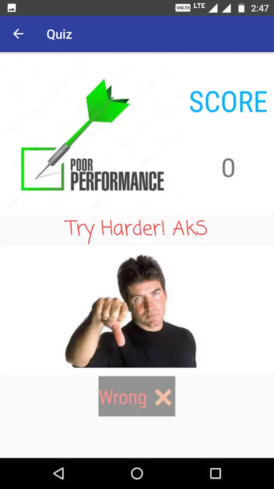

# Logic-Quiz
A Quiz application that is based on Logical and Analytical Reasoning based Questions which test these reasoning capacities of the individuals and ranks them according to the marks they score. There is also a timer attached with every question so the user has to solve the question within the given time limit.

 
 

